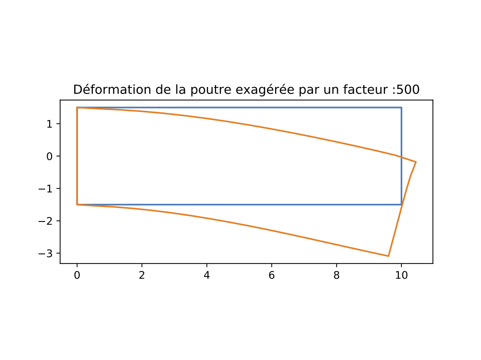

# simulation_elements_finis
Simulation de la flexion d'une barre de métal sous l'action d'une force

Pour commencer :
- Télécharger tous les fichiers dans un même répertoire.
- Ouvrir le fichier init et choisir les paramètres voulus, sauvegarder.
- Ouvrir le terminal; se placer dans la répertoire contenant les fichiers du dossier et taper 'python3 init.py' (remarque : avoir installer python3 sur la machine au préalable, ainsi que les packages sympy, numpy et matplotlib).

Le fichier documentation.pdf présente la démarche suivie, ainsi que des exemples de calcul.

L'image ci-dessous présente la déformation d'une poutre sous l'action d'une force verticale appliquée au coin supérieur droit. Pour calculer la déformation, les paramètres de simulation suivants sont utilisés: 
- E=1.18e11 (Module de Young du matériau)
- nu=0.31 (Coefficient de Poisson du matériau)
- Nombre d'éléments horizontaux pour le calcul : N=16
- Nombre d'éléments verticaux pour le calcul : NN=6
- Longueurs horizontale L (longueur) et verticale H (hauteur) de la poutre :L=10 et H=3
- Force de 4e4 * L = 4e5 N.

En bleu est représenté la position initiale de la poutre. En orange, la déformation après application de la force.