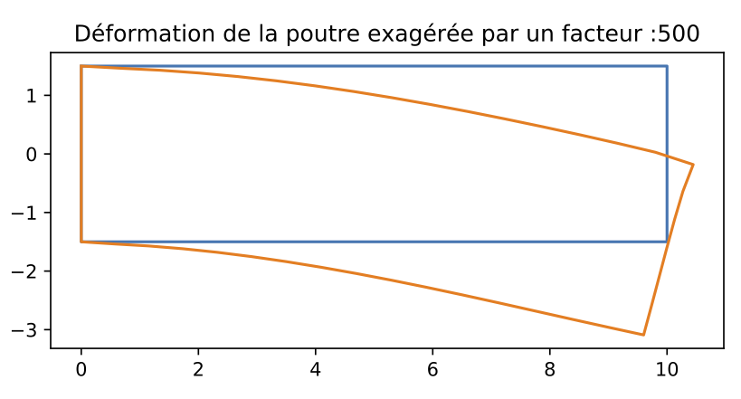

# simulation_elements_finis
Simulation de la flexion d'une barre de métal sous l'action d'une force

Prérequis :
- Python3 installé sur la machine ainsi que les packages sympy, numpy et matplotlib.

Pour commencer :
- Télécharger tous les fichiers dans un même répertoire.
- Ouvrir le fichier init et choisir les paramètres voulus, sauvegarder.
- Ouvrir le terminal; se placer dans la répertoire contenant les fichiers du dossier et taper 'python3 init.py' pour lancer le calcul
- Pour modifier les paramètres de calcul, ouvrir le fichier 'init.py' puis changer les paramètres utilisés.

Le fichier documentation.pdf présente la démarche suivie, ainsi que des exemples de calcul.

L'image ci-dessous présente la déformation calculée à l'aide de ce code pour une poutre sous l'action d'une force verticale appliquée au coin supérieur droit. Pour calculer la déformation, les paramètres de simulation suivants sont utilisés: 
- E=1.18e11 Pa (Module de Young du matériau).
- nu=0.31 (Coefficient de Poisson du matériau).
- Nombre d'éléments horizontaux pour le calcul : N=16.
- Nombre d'éléments verticaux pour le calcul : NN=6.
- Longueurs horizontale L (longueur) et verticale H (hauteur) de la poutre : L=10 m et H=3 m.
- Épaisseur D = 100 m.
- Force de 4e7 N vers le bas appliquée au coin supérieur droit.

 En bleu est représentée la position initiale de la poutre. En orange, la déformation calculée après application de la force.